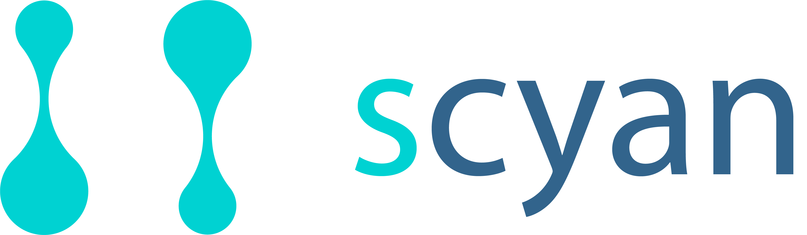

<br />

Scyan (**S**ingle-cell **Cy**tometry **A**nnotation **N**etwork) is a flow-based deep generative network that annotates mass and spectral cytometry cells. It leverages expert knowledge to make predictions without any gating or labeling required.

# Model features overview

What can be done with Scyan?

# Getting started

### Install with pip

Comming soon

### Install locally

Clone the repository and then

```
pip install -r requirements.txt
```

# Running scyan locally

Instead of using `scyan` as a library, you can also clone the repository and benefit from Weight & Biases (model monitoring) and Hydra (configuration manager).
We provide some examples of command lines:

```bash
# Simple run with default config
python run.py

# Using the debug trainer for a quick debugging
python run.py trainer=debug

# Use the GPU trainer and enable wandb and saves umap after training
python run.py trainer=gpu wandb.mode=online wandb.save_umap=true

# Hyperoptimization (-m option) with wandb enabled and working on the BMMC dataset
python run.py -m wandb.mode=online project=bmmc
```

For more details, have a look to the `config` folder and see Hydra and Weight & Biases documentation.

# Generate the docs

```bash
cd docs
sphinx-apidoc -o source ../scyan
make html
open build/html/index.html
```

Or autobuild: `sphinx-autobuild docs/source docs/_build/html`
