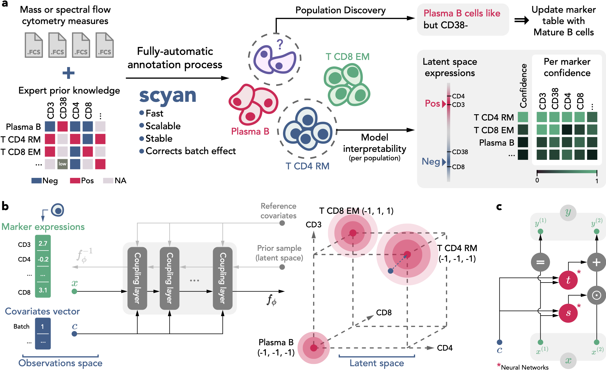

# Scyan documentation

  

Scyan stands for **S**ingle-cell **Cy**tometry **A**nnotation **N**etwork. Based on biological knowledge prior, it provides a fast cell population annotation without requiring any training label. Scyan is an interpretable model that also corrects batch-effect and can be used for debarcoding, cell sampling, and population discovery.

## Overview

Scyan is a Bayesian probabilistic model composed of a deep invertible neural network called a normalizing flow (the function $f_{\phi}$). It maps a latent distribution of cell expressions into the empirical distribution of cell expressions. This cell distribution is a mixture of gaussian-like distributions representing the sum of a cell-specific and a population-specific term. Also, interpretability and batch effect correction are based on the model latent space — more details in the article's Methods section.

  

