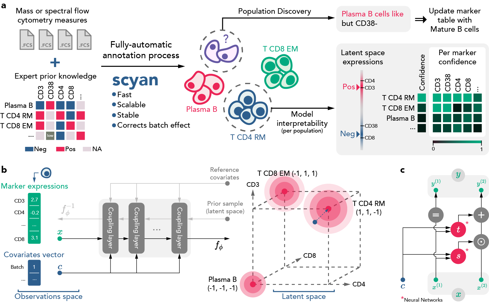

# Scyan documentation

  

Scyan stands for **S**ingle-cell **Cy**tometry **A**nnotation **N**etwork. Based on biological knowledge prior, it provides a fast cell population annotation without requiring any training label. Scyan is an interpretable model that also corrects batch-effect and can be used for debarcoding / cell sampling / population discovery.

## Overview

Scyan is a Bayesian probabilistic model composed of a deep invertible neural network called a normalizing flow (the function $f_{\phi}$). It maps a latent distribution of cell expressions into the empirical distribution of cell expressions. This cell distribution is a mixture of gaussian-like distributions representing the sum of a cell-specific and a population-specific term. Also, interpretability and batch effect correction are based on the model latent space — more details in the article's Methods section.

<figure markdown>
  
  <figcaption>a) Overview of the tasks that Scyan can perform. b) Overview of the model architecture. c) One coupling layer, i.e., the elementary unit that composes the Normalizing Flow.</figcaption>
</figure>

## Technical description

Scyan is a **Python** library based on:

- _Pytorch_, a deep learning framework
- _AnnData_, a data library that works nicely with single-cell data
- _Pytorch Lighning_, for model training
- _Hydra_, for project configuration (optional)
- _Weight & Biases_, for model monitoring (optional)

## Project layout

See [Scyan on Github](https://github.com/MICS-Lab/scyan)

    config/       # Hydra configuration folder (optional use)
    data/         # Data folder containing adata files and csv tables
    docs/         # The folder used to build the documentation
    scripts/      # Scripts to reproduce the results from the article
    tests/        # Folder containing tests
    scyan/                    # Library source code
        module/               # Folder containing neural network modules
            coupling_layer.py # Coupling layer
            distribution.py   # Prior distribution (called U in the article)
            real_nvp.py       # Normalizing Flow
            scyan_module      # Core module
        plot/                 # Plotting tools
            ...
        data/                 # Folder with data-related functions and classes
            ...
        mmd.py                # Maximum Mean Discrepancy implementation
        model.py              # Scyan model class
        preprocess.py         # Preprocessing functions
        utils.py              # Misc functions
    .gitattributes
    .gitignore
    .gitlab-ci.yml    # CI that builds documentation
    CONTRIBUTING.md   # To read before contributing
    LICENSE
    mkdocs.yml        # The docs configuration file
    poetry.lock
    pyproject.toml    # Dependencies, project metadata, and more
    README.md
    setup.py          # Setup file, see `pyproject.toml`
