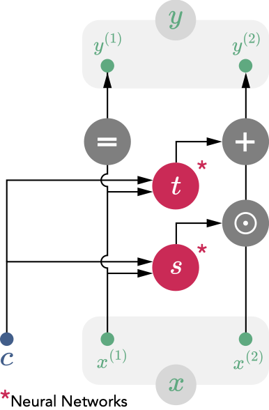

Here we briefly describe the maths behind Scyan. For more details, refer to the method section of [our article](https://doi.org/10.1093/bib/bbad260).

## Notations

| Symbol      | Belongs to | Description                          |
| ----------- | -----------|------------------------------------ |
| $P$ | $\mathbb{N}^*$ | Number of populations  |
| $N$ | $\mathbb{N}^*$ | Number of cells |
| $M$ | $\mathbb{N}^*$ | Number of markers |
| $M_{c}$ | $\mathbb{N}^*$ | Number of covariates per cell |
| $\pmb{\pi} = (\pi_z)_{1 \leq z \leq P}$ | $]0, 1[^P$ | Population size ratios (i.e., $\sum_z \pi_z = 1$). This parameter is learned during training. |
| $\pmb{\rho}$ | $(\mathbb{R} \cup \{NA\})^{P \times M}$ | Knowledge table. For a population $z$ and a marker $m$, the value $\rho_{z,m}$ describes the expected expression of $m$ by population $z$. Typical values are: $-1$ for negative, $1$ for positive, NA when not known. | 
| $\pmb{x_i}$ | $\mathbb{R}^M$ | Each $\pmb{x_i}$ is the vector of preprocessed marker expression of the cell $i \in [1\cdots N]$|
| $\pmb{c_i}$ | $\mathbb{R}^{M_c}$ | Each $\pmb{c_i}$ is the vector of covariates associated to the cell $i \in [1\cdots N]$|

## Generative process

We assume that the cell expressions come from the generative process below, where $f_{\pmb{\phi}}$ is the normalizing flow detailed in the next section. We define the following random variables: $Z$ the random population, $\pmb{E}$ the population-specific latent marker expressions, $\pmb{H}$ a cell-specific term, $\pmb{U}$ the latent expressions, and $\pmb{X}$ the actual (preprocessed) marker expressions.

\[
    Z \sim Categorical(\pmb{\pi})
\]

\[\pmb{E} \; | \; Z = (e_m)_{1 \leq m \leq M} \mbox{, where }
        \left\{
            \begin{array}{ll}
                e_m = \rho_{Z,m} & \mbox{if }\rho_{Z,m} \neq \mbox{NA} \\
                e_m \sim \mathcal{U}([-1, 1]) & \mbox{otherwise,}
            \end{array}
        \right.
\]

\[
    \pmb{H} \sim \mathcal{N}(\pmb{0}, \sigma \mathbb{\pmb{I_M}})
\]

\[
    \pmb{U} = \pmb{E} + \pmb{H}
\]

\[
    \pmb{X} = f_{\pmb{\phi}}^{-1}(\pmb{U})
\]

The latent distribution $\pmb{U}$ is defined on $\mathbb{R}^M$, i.e. the same space as the original marker expressions. Each dimension of the latent space corresponds to one marker. These latent marker expressions are meant to be free of batch effect or any non-biological factor.

We can summarize this generative process with the figure below. $\pmb{U}$ corresponds to the mixture distribution in red (right), while $\pmb{X}$ corresponds to the distribution of cells marker expressions (left). The normalizing flow $f_{\pmb{\phi}}$ is the mapping between these two distributions.

  

!!! Interpretation
    In this latent space, all marker expressions share the same scale (close to $[-1, 1]$, but not necessarily inside). For instance, a latent expression close to 1 is a positive expression, close to -1 is negative, while close to 0 would be a mid expression.
## Normalizing flow

The normalizing flow is a stack of multiple coupling layers: $f_{\pmb{\phi}} := f^{(L)} \circ f^{(L-1)} \circ \dots \circ f^{(1)}$ with $L$ the number of coupling layers. Each coupling layer $f^{(i)}: (\pmb{x}, \pmb{c}) \mapsto \pmb{y}$ splits both $\pmb{x}$ and $\pmb{y}$ into two components $(\pmb{x^{(1)}}, \pmb{x^{(2)}}), (\pmb{y^{(1)}}, \pmb{y^{(2)}})$ on which distinct transformations are applied (the split is different for each layer). We propose below an extension of the traditional coupling layer to integrate covariates $\pmb{c}$:

\[
    \begin{cases}
      \pmb{y^{(1)}} = \pmb{x^{(1)}}\\
      \pmb{y^{(2)}} = \pmb{x^{(2)}} \odot exp\Big(s([\pmb{x^{(1)}}; \pmb{c}])\Big) + t([\pmb{x^{(1)}}; \pmb{c}]).
    \end{cases}  
\]

On the equation above, $s$ and $t$ are Multi-Layer-Perceptrons (MLPs). The coupling layer architecture is illustrated below:

  

Overall, the normalizing flow has some interesting properties that help preserve the biological variability as much as possible:

- The coupling layers preserve the order relation for two different expression values.
- The loss penalizes huge space distortion (the log determinant term in the equation below).

!!! note
    Each coupling layer is invertible, so is $f_{\pmb{\phi}}$. Also, the log determinant of the jacobian of each layer is easy to compute, which is crucial to compute the loss function below.

## Loss
We optimize the Kullback–Leibler (KL) divergence defined below by stochastic gradient descent. More details leading to this expression and how to compute it can be found in the article methods section.

\[
    \mathcal{L}_{KL}(\pmb{\theta}) = - \sum_{1 \leq i \leq N} \bigg[ log \: \Big( p_U(f_{\pmb{\phi}}(\pmb{x_i}, \pmb{c_i}); \pmb{\pi}) \Big) + log \;  \Big| det \frac{\partial f_{\pmb{\phi}}(\pmb{x_i}, \pmb{c_i})}{\partial \pmb{x}^T} \Big| \bigg].
\]

We optimize the loss on mini-batches of cells using the Adam optimizer.

!!! note
    In the above equation, $p_U(f_{\pmb{\phi}}(\pmb{x_i}, \pmb{c_i}); \pmb{\pi}) = \sum_{z=1}^P \pi_z \cdot p_{U \mid Z = z}(f_{\pmb{\phi}}(\pmb{x_i}, \pmb{c_i}))$, which is not computationally tractable because the presence of NA in $\pmb{\rho}$ leads to the summation of a uniform and a normal random variable. We approximate the density of the sum of the two random variables by a piecewise density function.

## Annotating cell-types
Once finished training, the annotation process $\mathcal{A}_{\pmb{\theta}}$ consists in choosing the most likely population according to the data using Bayes's rule. So, for a cell $\pmb{x}$ with covariates $\pmb{c}$, we have:

\[
    \mathcal{A}_{\pmb{\theta}}(\pmb{x}, \pmb{c}) = argmax_{1 \leq z \leq P} \; \; \pi_z \cdot p_{U \mid Z = z}(f_{\pmb{\phi}}(\pmb{x}, \pmb{c})).
\]

We also define a log threshold $t_{min}$ to decide whether or not to label a cell, i.e., we don't label a cell if $max_{1 \leq z \leq P} \; \; p_{U \mid Z = z}(f_{\pmb{\phi}}(\pmb{x}, \pmb{c})) \leq e^{t_{min}}$.

## Correcting batch effect

When the batches are provided into the covariates, the normalizing flow will naturally learn to align the latent representations of the multiple different batches. After model training, we can choose a batch as the reference and its corresponding covariates $\pmb{c}_{ref}$. Then, for a cell $\pmb{x}$ with covariates $\pmb{c} \neq \pmb{c_{ref}}$, its batch-effect corrected expressions are, $\tilde{\pmb{x}} = f_{\pmb{\phi}}^{-1}\Big(f_{\pmb{\phi}}(\pmb{x}, \pmb{c}), \pmb{c_{ref}}\Big)$.

!!! note
    In this manner, we get expressions $\tilde{\pmb{x}}$ as if $\pmb{x}$ were cell expressions from the reference batch. Applying $f_{\pmb{\phi}}$ removes the batch effect, and applying $f_{\pmb{\phi}}^{-1}$ recreates expressions that look like expressions of the reference batch.